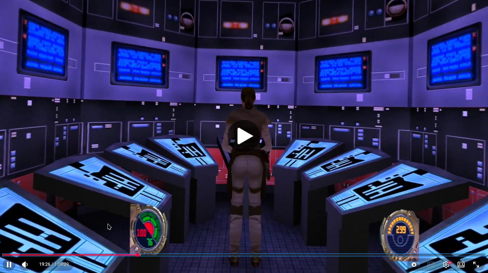

===

# JK XR

JK XR is a VR port of the Jedi Knight games using OpenXR (the open standard for virtual and augmented reality devices) and is based on the excellent OpenJK port, originally forked from: https://github.com/JACoders/OpenJK

## Native Linux PCVR (this fork)

This fork adds a **native Linux PCVR build** of JK XR — both Jedi Academy and
Jedi Outcast single-player — using the OpenXR X11/GLX graphics binding. No
Wine/Proton needed. Tested on Arch Linux with the WiVRn runtime (also works
with Monado/SteamVR).

Quick start (you need your own copy of the games, e.g. from Steam or GOG):

```sh
./build_linux.sh
./install_linux.sh jka "$HOME/.local/share/Steam/steamapps/common/Jedi Academy/GameData"
./install_linux.sh jko "$HOME/.local/share/Steam/steamapps/common/Jedi Outcast/GameData"
```

then, with your OpenXR runtime active:

* For Jedi Academy:
```sh
cd "(...)/Jedi Academy/GameData" && SDL_VIDEODRIVER=x11 ./openjk_sp.x86_64
```

* For Jedi Outcast:
```sh
cd "(...)/Jedi Outcast/GameData" && SDL_VIDEODRIVER=x11 ./openjo_sp.x86_64
```

Where `(...)` is the rest of the path for your game.

Arch Linux users can instead build a system package from
[packaging/arch/PKGBUILD](packaging/arch/PKGBUILD), which provides `jkxr-jka`
and `jkxr-jko` launchers. Full instructions, file layout and troubleshooting:
[BUILDING_LINUX.md](BUILDING_LINUX.md).

If you have the game(s) on Steam, I would advise to use these strings as launch options:

* For Jedi Outcast: `cmd=(%command%); JKXR_JKO_GAMEDATA="$(dirname "${cmd[-1]}")" jkxr-jko`
* For Jedi Academy: `cmd=(%command%); JKXR_JKA_GAMEDATA="$(dirname "${cmd[-1]}")" jkxr-jka`

This way the game will automatically start in VR mode when you press Play and its playing time will be recorded on Steam.

### Shadow quality levels

This fork expands the character-shadow setting (**Setup -> More Video -> Shadows**)
into five levels:

* **None** — shadows off.
* **Low** — a soft blob projected on the ground (the original cheap shadow).
* **High** — a hard black silhouette projected onto a single ground plane (can
  float next to stairs and edges).
* **Very High** — a translucent, hard-edged stencil silhouette that correctly
  drapes over stairs, walls and uneven ground, giving a real sense of volume.
* **Ultra** — the same stencil shadow with soft, feathered edges (a real
  penumbra), produced by blurring the shadow mask in screen space. This is the
  most natural, modern-looking option.

Ultra's blur has a **fixed per-frame cost** (independent of how many characters
are on screen), so it stays cheap even in crowded cutscenes. The five levels
still let you pick the balance of looks and framerate for your hardware.

Fine-tuning via the console: `r_shadowAlpha` sets shadow darkness; `r_shadowBlur`
sets the Ultra penumbra width in pixels (default `16`). Setting `r_shadowBlur 0`
selects the older multi-pass layered penumbra instead, whose smoothness and width
are then controlled by `r_shadowSoft` (number of taps) and `r_shadowSoftSpread`.

## Demo Video (on Linux)

[](https://www.youtube.com/watch?v=U9MpaD9U0Jc)

## Team Beef Patreon
[](https://www.patreon.com/teambeef)

The Team Beef Patreon where you can find all the in-development early-access builds other active Team Beef projects.


## Gameplay and VR Features

### VR Features

* New Fully Modelled VR Weapons
* Full Motion Controlled Light Saber
* Real Collision based Laser Deflections
* Weapon / Force wheels 
* Gesture Based Use / Interact
* Gesture based Force Actions (Push, Pull and Grab)
* Weapon Scopes
* Gesture Based Saber Throw 

### Gameplay Modes (accessible via Setup -> Difficulty in the Menu)

**Team Beef Directors Cut (TBDC) - On (Default is On)**
This version uses faithful enemy speeds and aggression from the original game, which are fast and challenging by modern standards. To balance this projectile speeds and gun power are raised to feel more canon to the Star Wars movies and prevent Stormtroopers and other enemies from being able to avoid gunfire by strafing. There are also exaggerated knockback effects. This mode is more arcade-y fast paced affair whilst feeling similar to the difficulty level of the twitch-based gameplay of the original game. 

**Team Beef Directors Cut (TBDC) - Off**
Projectile speeds are faithful to the original game, but enemy movement and aggression are toned back, where stormtroopers don't have an easy time to flank you. You may need to still "lead" shots slightly ahead of enemies when they are on the move. Recommended for a slower paced tactical encounter

To switch between modes change the option and if already in-game, restart the level you are on. 

## IMPORTANT NOTE

*This is just an engine port*; the engine does not contain any of the Jedi Knight game assets. If you wish to play the full game you must purchase it yourself, steam is most straightforward:  https://store.steampowered.com/app/6030/STAR_WARS_Jedi_Knight_II__Jedi_Outcast/

## OpenXR runtimes information for PCVR Headsets

We recommend the following combinations to get the optimal experience while playing JKXR on PCVR:

**Valve Index** -> Via SteamVR (SteamVR OpenXR Runtime)

**HTC Vive** -> Via SteamVR (SteamVR OpenXR Runtime)

**Meta Headsets** -> Link / Airlink (Oculus OpenXR Runtime) / SteamLink / Virtual Desktop (VDXR or SteamVR)

**Windows Mixed Reality (WMR) Devices** (I.e. HP G2) -> Make sure you set the SteamVR to be the default OpenXR runtime. 

**Pimax** -> Currently unplayable. We have been in discussions with Pimax and there is a new PimaxPlay that fixes the issues (upside down screens). 
When released the game must be played via unofficial PimaxXR OpenXR runtime (https://github.com/mbucchia/Pimax-OpenXR). Do not play via SteamVR OpenXR runtime

**Pico** - Virtual Desktop (VDXR or SteamVR) / Streaming Assistant (Currently Untested)


## Controls and configuration

### Tutorials 

You can find tutorial videos on how to use the special VR features in the in-game Controls -> JKXR HELP menu. 


### Control Scheme

This control scheme on how to play can also be found in the Controls -> JKXR HELP in the game.


## Credits

* Team Beef are DrBeef,  Baggyg,  Bummser
* Lead programmer: DrBeef
* JKXR Companion App: BaggyG
* Additional Development Contributions: MuadDib, BaggyG
* VR Compatible Weapon Models: Vince Crusty  and  Elin
* VR Compatible Hand Models: LennyGuy20

With Special Thanks to: Team Beef patrons, all Team Beef discord members, 
the OpenJK Development Team and Raven Software for
creating and open-sourcing these wonderful games

## DISCLAIMER

THIS ENGINE PORT IS NOT MADE, DISTRIBUTED, OR SUPPORTED BY ACTIVISION PUBLISHING, INC., RAVEN SOFTWARE, OR LUCASARTS ENTERTAINMENT COMPANY, LLC. ELEMENTS™ & © LUCASFILM LTD.™ & DISNEY, INC.™ AND/OR ITS LICENSORS. STAR WARS®, JEDI®, & JEDI KNIGHT® ARE REGISTERED TRADEMARKS OF LUCASFILM LTD™ AND WALT DISNEY, INC.™ STAR WARS®, JEDI®, & JEDI KNIGHT® ARE REGISTERED TRADEMARKS OF LUCASFILM LTD™ & DISNEY, INC.™
