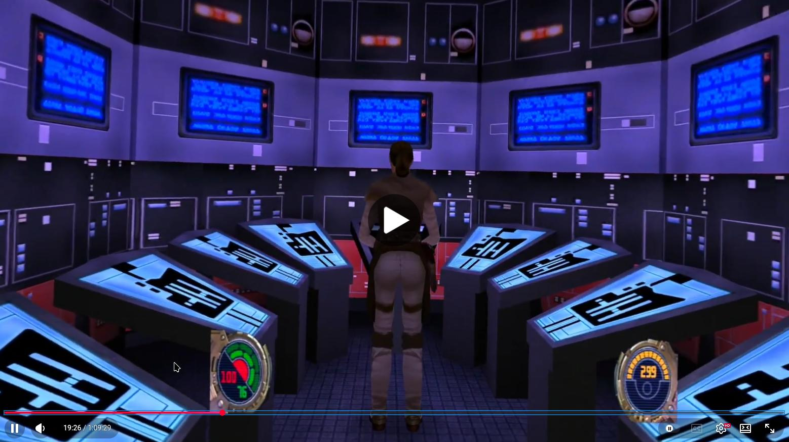

# JKXRL 0.6

**Jedi Academy and Jedi Outcast in native Linux VR**, using Vulkan, SDL3 and
OpenXR. JKXRL is Patola's Linux fork of [Team Beef's JKXR](https://github.com/DrBeef/JKXR),
built on [OpenJK](https://github.com/JACoders/OpenJK). No Wine, Proton or FEX is
needed for this x86-64 release.

[Download v0.6](https://github.com/Patola/JKXRL/releases/tag/v0.6) |
[Installation/build guide](BUILDING_LINUX.md) |
[Console variables](OpenJK/docs/console-variables.md) |
[Roadmap](ROADMAP.md)

## Play on Arch Linux

Download `jkxrl-0.6-2-x86_64.pkg.tar.zst` from the release, then:

```sh
sudo pacman -U ./jkxrl-0.6-2-x86_64.pkg.tar.zst
```

The package conflicts with the older `jkxrl-git` package; accept its replacement
when upgrading. Existing `jkxr-jka` / `jkxr-jko` commands, `JKXR_*_GAMEDATA`
variables and save/config paths remain compatible. Start your OpenXR runtime
and connect the headset, then launch:

```sh
JKXR_JKA_GAMEDATA="/path/to/Jedi Academy/GameData" jkxr-jka
JKXR_JKO_GAMEDATA="/path/to/Jedi Outcast/GameData" jkxr-jko
```

The default Steam library is detected automatically. You must own the original
games (Steam/GOG); **commercial game data is not included**. The package includes
both engines, Vulkan renderers, game modules, VR assets and launchers.

Requirements: Linux x86-64, Vulkan 1.3+, SDL3, and an active OpenXR runtime
supporting `XR_KHR_vulkan_enable2`. The primary tested setup is Arch Linux,
Mesa/Radeon RX 7900 XTX and Quest 3 through WiVRn. Other hardware/runtimes need
community testing. This is not an ARM64 or standalone-headset release yet.

## What's in v0.6

- Vulkan-only renderer, SDL3 platform support and C++17 for both games.
- Tracked weapons/sabers, dual-saber force controls, haptics and mounted/vehicle aiming.
- Soft shadows, dynamic saber illumination and optional bloom (off by default).
- Restored cinematics/audio, scopes, goggles, weather, local fog, animated
  materials, vegetation, decals, glass and many other effects.
- World-locked console with a laser-operated virtual keyboard: long-press Y
  during gameplay; short press retains the datapad action.
- Save previews, controller-operated menus and numerous gameplay/rendering fixes.

Both games are playable and have passed extensive targeted headset testing.
Full campaign validation and broader hardware testing continue. See
[release notes](RELEASE_NOTES.md) for scope and limitations.

## Build from source

```sh
./build_linux.sh
./install_linux.sh jka "$HOME/.local/share/Steam/steamapps/common/Jedi Academy/GameData"
./install_linux.sh jko "$HOME/.local/share/Steam/steamapps/common/Jedi Outcast/GameData"
```

Then, with your OpenXR runtime active:

* For Jedi Academy:
```sh
cd "(...)/Jedi Academy/GameData" && SDL_VIDEODRIVER=x11 ./openjk_sp.x86_64
```

* For Jedi Outcast:
```sh
cd "(...)/Jedi Outcast/GameData" && SDL_VIDEODRIVER=x11 ./openjo_sp.x86_64
```

Where `(...)` is the rest of the path for your game.

Arch Linux users can instead build a system package from
[packaging/arch/PKGBUILD](packaging/arch/PKGBUILD), which provides `jkxr-jka`
and `jkxr-jko` launchers. Full instructions, file layout and troubleshooting:
[BUILDING_LINUX.md](BUILDING_LINUX.md).

For the current Vulkan/SDL3 release, see the
[Console Variable Reference](OpenJK/docs/console-variables.md) for inherited and
new settings, defaults, persistence, caveats and legacy-only variables. It takes
precedence over historical OpenGL tuning advice from older releases.

If you have the game(s) on Steam, I would advise to use these strings as launch options:

* For Jedi Outcast: `cmd=(%command%); JKXR_JKO_GAMEDATA="$(dirname "${cmd[-1]}")" jkxr-jko`
* For Jedi Academy: `cmd=(%command%); JKXR_JKA_GAMEDATA="$(dirname "${cmd[-1]}")" jkxr-jka`

This way the game will automatically start in VR mode when you press Play and its playing time will be recorded on Steam.

### Graphics settings

Use **Setup -> More Video** for shadows, optional bloom, Force Speed Motion Blur
and other settings. The Vulkan shadow implementation replaces the earlier
OpenGL stencil path; `r_shadowBlur`/`r_shadowSoft` advice from older releases
does not describe this renderer. See the current console reference for tuning.

## Demo Video (on Linux)

This video shows the earlier Linux/OpenGL release, not v0.6's Vulkan renderer.

[](https://www.youtube.com/watch?v=U9MpaD9U0Jc)

## Team Beef Patreon
[](https://www.patreon.com/teambeef)

The Team Beef Patreon where you can find all the in-development early-access builds other active Team Beef projects.


## Gameplay and VR Features

### VR Features

* New Fully Modelled VR Weapons
* Full Motion Controlled Light Saber
* Real Collision based Laser Deflections
* Weapon / Force wheels 
* Gesture Based Use / Interact
* Gesture based Force Actions (Push, Pull and Grab)
* Weapon Scopes
* Gesture Based Saber Throw 

### Gameplay Modes (accessible via Setup -> Difficulty in the Menu)

**Team Beef Directors Cut (TBDC) - On (Default is On)**
This version uses faithful enemy speeds and aggression from the original game, which are fast and challenging by modern standards. To balance this projectile speeds and gun power are raised to feel more canon to the Star Wars movies and prevent Stormtroopers and other enemies from being able to avoid gunfire by strafing. There are also exaggerated knockback effects. This mode is more arcade-y fast paced affair whilst feeling similar to the difficulty level of the twitch-based gameplay of the original game. 

**Team Beef Directors Cut (TBDC) - Off**
Projectile speeds are faithful to the original game, but enemy movement and aggression are toned back, where stormtroopers don't have an easy time to flank you. You may need to still "lead" shots slightly ahead of enemies when they are on the move. Recommended for a slower paced tactical encounter

To switch between modes change the option and if already in-game, restart the level you are on. 

## IMPORTANT NOTE

*This is just an engine port*; the engine does not contain any of the Jedi Knight game assets. If you wish to play the full game you must purchase it yourself, steam is most straightforward:  https://store.steampowered.com/app/6030/STAR_WARS_Jedi_Knight_II__Jedi_Outcast/

## Runtime and hardware coverage

WiVRn is the primary tested runtime for this Linux fork. Other Linux OpenXR
runtimes and headsets require independent validation; the upstream JKXR Windows
runtime recommendations do not apply to this Linux-only package. Please report
your GPU/driver, headset/runtime, game/map and logs with any issue.


## Controls and configuration

### Tutorials 

You can find tutorial videos in the in-game Controls -> JKXRL HELP menu.
Upstream tutorial media may still show the JKXR name.


### Control Scheme

This inherited control scheme is also available in Controls -> JKXRL HELP.


## Credits

* Linux port, OpenGL-to-Vulkan/SDL3 port and additional features: **Patola**, with **ChatGPT Codex** development assistance.
* Team Beef are DrBeef,  Baggyg,  Bummser
* Lead programmer: DrBeef
* JKXR Companion App: BaggyG
* Additional Development Contributions: MuadDib, BaggyG
* VR Compatible Weapon Models: Vince Crusty  and  Elin
* VR Compatible Hand Models: LennyGuy20

With Special Thanks to: Team Beef patrons, all Team Beef discord members, 
the OpenJK Development Team and Raven Software for
creating and open-sourcing these wonderful games

Upstream attribution and compatibility identifiers are deliberately retained.
JKXRL's version is independent of JKXR's version. See also
[packaged asset credits](assets/packaged_mods_credits.txt) and [LICENSE.txt](LICENSE.txt).

## DISCLAIMER

THIS ENGINE PORT IS NOT MADE, DISTRIBUTED, OR SUPPORTED BY ACTIVISION PUBLISHING, INC., RAVEN SOFTWARE, OR LUCASARTS ENTERTAINMENT COMPANY, LLC. ELEMENTS™ & © LUCASFILM LTD.™ & DISNEY, INC.™ AND/OR ITS LICENSORS. STAR WARS®, JEDI®, & JEDI KNIGHT® ARE REGISTERED TRADEMARKS OF LUCASFILM LTD™ AND WALT DISNEY, INC.™ STAR WARS®, JEDI®, & JEDI KNIGHT® ARE REGISTERED TRADEMARKS OF LUCASFILM LTD™ & DISNEY, INC.™
